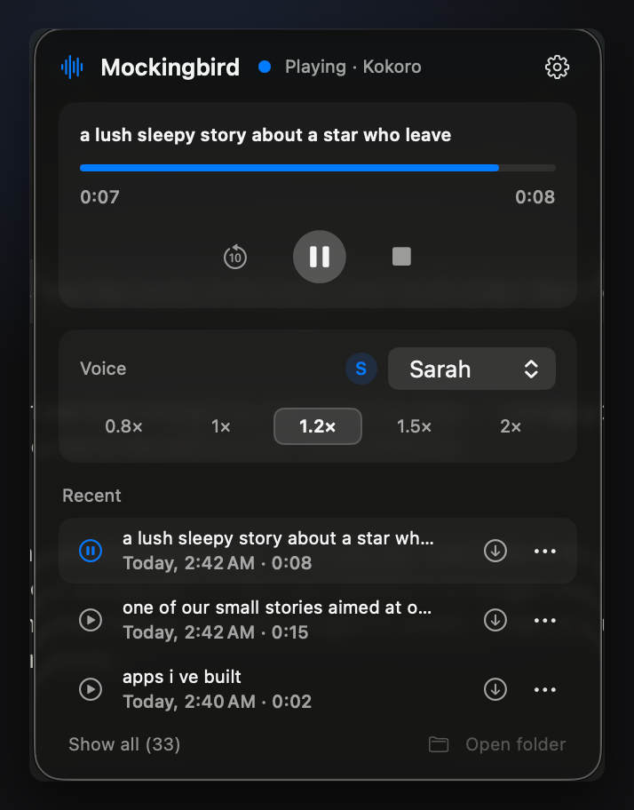

# Mockingbird

**Select text anywhere on your Mac and hear it read aloud — natural neural
voices, fully on-device.**

Mockingbird is a small menu-bar app: select text in any app, press
`Ctrl+Option+S`, and listen. Pause and resume with `Ctrl+Option+P`. Speech is
generated locally by the voice engine of your choice — no accounts, no cloud,
and after the one-time engine download it works fully offline.



**[Download for macOS 14+ (Apple Silicon)](https://www.awsleiman.com/apps/mockingbird/)**
— signed and notarized, auto-updates via Sparkle. Or build it yourself below.
MIT licensed.

## What It Owns

- First-run onboarding that explains the app and downloads a voice engine of your choice.
- Global hotkeys, no Apple Shortcuts app required.
- Cold-start synthesis: no speech process stays resident while idle.
- Menu bar controls for engine choice, generation state, playback progress, pause/resume, stop, voice settings, audio cache, and editable hotkeys.

Default hotkeys:

- Read selection / stop current reading: `Control + Option + S`
- Pause/resume: `Control + Option + P`

You can edit them from the Mockingbird menu.

## Voice Engines

The app ships tiny and nothing is self-hosted. On first launch, onboarding asks the user to pick an engine and builds it on the fly:

- **Kokoro** (recommended) — the most natural neural voices. Model weights and voices fetched from Hugging Face (`hexgrad/Kokoro-82M`). ≈1.3 GB installed.
- **Piper** (fast & light) — compact ONNX voices, quick on modest hardware. Voices fetched from `rhasspy/piper-voices`. ≈470 MB installed.
- **Apple System Voices** — no download; uses the voices built into macOS.

For Kokoro and Piper, `scripts/engine_setup.sh` bootstraps `uv` (a single static binary from astral.sh), creates a private Python 3.12 venv under the app's runtime folder, and installs version-pinned packages from PyPI (`python/requirements-<engine>.txt`). No system-wide installs, no Homebrew, no pre-existing Python required. Model weights are downloaded by the app with byte-level progress.

Engines live in `~/Library/Application Support/Mockingbird/engines`, models in `.../models`. Users can switch, install, or uninstall engines any time from Settings > Voice Engine (menu bar icon > gear > Settings).

## Build And Launch

```bash
scripts/package_app.sh
scripts/launch.sh
```

The packaged app lives at:

```bash
Mockingbird.app
```

## Ship To Another Mac

Build a DMG, then share `dist/Mockingbird.dmg`:

```bash
scripts/export_dmg.sh
```

The recipient opens the DMG, drags `Mockingbird.app` to Applications, and launches it. Onboarding walks them through downloading a voice engine — they do not need Python, Homebrew, or developer tools installed.

You can also create a zip archive with:

```bash
scripts/export_app.sh
```

Local builds are ad-hoc signed by default. For a DMG intended for other Macs without Gatekeeper workarounds, sign with a Developer ID Application certificate:

```bash
MOCKINGBIRD_CODESIGN_IDENTITY="Developer ID Application: Your Name (TEAMID)" scripts/export_dmg.sh
```

### Legacy packaging modes

```bash
MOCKINGBIRD_BUNDLE_SPEECH_HELPER=1 scripts/package_app.sh   # old self-contained app with Kokoro baked in (~900MB)
MOCKINGBIRD_REUSE_SPEECH_HELPER=1 MOCKINGBIRD_BUNDLE_SPEECH_HELPER=1 scripts/package_app.sh  # reuse an already-built helper
MOCKINGBIRD_SKIP_SPEECH_HELPER=1 scripts/package_app.sh     # dev build that installs a Python venv on first run
```

## Local Runtime

Mockingbird keeps engines, models, generated audio, and request files in its Application Support folder, not in this repository. Local helper scripts such as `scripts/read-selected.sh`, `scripts/pause.sh`, and `scripts/stop.sh` send commands to that runtime folder.

## Privacy

Mockingbird does not listen to your microphone. It only reads selected text when you press the read hotkey. Speech is generated locally; after the one-time engine download, no internet connection is used.
